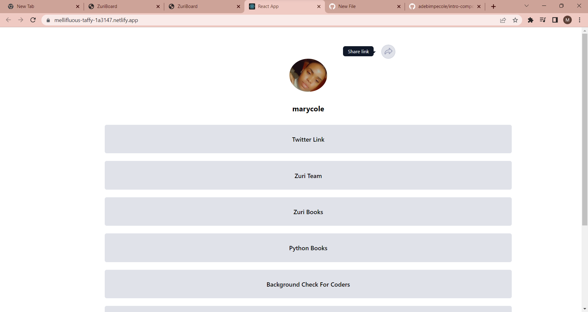

# Profile - Zuri Task 1

This is a solution to the [Intro component with sign up form challenge on Frontend Mentor](https://www.frontendmentor.io/challenges/intro-component-with-signup-form-5cf91bd49edda32581d28fd1). Frontend Mentor challenges help you improve your coding skills by building realistic projects. 

## Table of contents

- [Overview](#overview)
  - [The challenge](#the-challenge)
  - [Screenshot](#screenshot)
  - [Links](#links)
- [My process](#my-process)
  - [Built with](#built-with)
  - [What I learned](#what-i-learned)
  - [Continued development](#continued-development)
- [Author](#author)

## Overview

### The challenge

Users should be able to:

- View the optimal layout for the site depending on their device's screen size
- See hover states for all interactive elements on the page

### Screenshot




### Links

- Solution URL: [Add solution URL here](https://github.com/adebimpecole/profile.git)
- Live Site URL: [Add live site URL here](https://soft-eclair-07ffdb.netlify.app/contact)

## My process

### Built with

- CSS custom properties
- CSS Flex
- Mobile-first workflow
- React JS

### What I learned

I learnt how to create a tooltip and its functionality

```js
const Show = (data) => {
    data.currentTarget.firstChild.nextSibling.style.display = "block"
    data.currentTarget.firstChild.nextSibling.style.transition = ".1s";
 }
```

### Continued development

- Conditional styling

## Author

- Website - [Cole Mary](https://soft-eclair-07ffdb.netlify.app/contact)
- Twitter - [@adecole02](https://twitter.com/adecole02)
